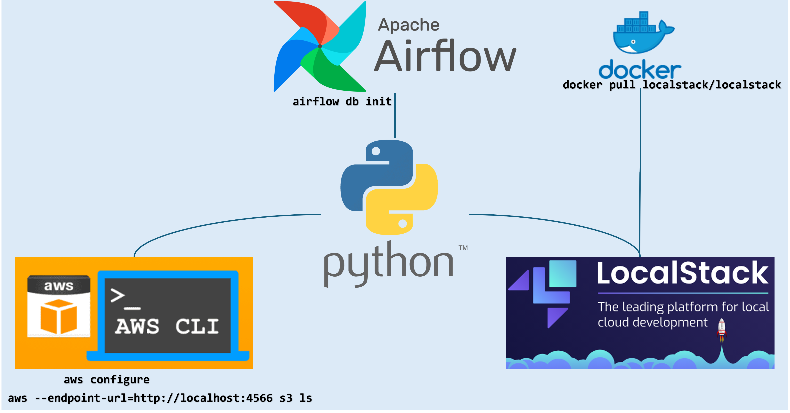

# AirFlow-AWS Cli-localstack-docker
This project demonstrates the integration of AirFlow, AWS CLI, LocalStack, and Docker to create a fully isolated, locally emulated AWS environment for development, testing, and automation of cloud workflows. The project is developed in Python, with pytest used for unit and integration testing. This can extend for other aws services like EC2, lambda, DynamoDB, Kinesis, SQS, SNS, etc.  

### Project Workflow:
1. Set up LocalStack with Docker.
2. Initialize AirFlow and create DAGs that interact with AWS services (e.g., managing S3 buckets).
3. Use AWS CLI configured with LocalStack to perform actions (e.g., listing, creating S3 buckets).
4. Write pytest test cases to validate the workflow.
5. Automate the entire process using AirFlow’s scheduler, running tasks on the local environment.

### Use Cases:
1. Automated data processing pipelines in a locally simulated cloud environment.
2. Development and testing of AWS workflows without incurring real AWS costs.
3. Integration of AWS S3, Lambda, and other services for various workflows such as ETL processes and data analysis, all within a local setup.

### Docker:

Docker is used to run LocalStack, a fully functional local AWS cloud environment. It allows the emulation of AWS services such as S3, Lambda, and more.
The command `docker pull localstack/localstack` pulls the LocalStack image, and `docker run -d --name localstack -p 4566:4566 -p 4571:4571 localstack/localstack `sets up the environment.

Downalod and install [Docker Desktop](https://www.docker.com/products/docker-desktop/). Visit [Docker Documentation](https://docs.docker.com/desktop/) for developer(s). 

### LocalStack:

LocalStack simulates AWS services like S3 locally, allowing developers to run tests and workflows without needing real AWS services.
After setting up LocalStack, you can use AWS CLI to interact with it by configuring the AWS endpoint locally (--endpoint-url=http://localhost:4566).
Example: Using the command `aws --endpoint-url=http://localhost:4566 s3 ls` to list S3 buckets in the local environment.

Read more about aws services, tutorials, applications and etc [LocalStack](https://docs.localstack.cloud/overview/). 

### AirFlow:

AirFlow is utilized to manage workflows. This setup includes initializing AirFlow (`airflow db init`), creating users, and setting up the web server and scheduler to automate the execution of tasks.
The project uses AirFlow DAGs to automate interactions with the AWS services (emulated by LocalStack), such as creating and managing S3 buckets and other workflows. Create a user domain for airflow using - `airflow users create --username admin --password admin --firstname Admin --lastname User --role Admin --email airflow@example.com`

[AirFlow](https://airflow.apache.org/docs/apache-airflow/stable/start.html) installation guide and developers documentation.    

### AWS CLI:

AWS CLI is configured to interact with the LocalStack services. The `aws configure` command is used to set up the credentials and region for the AWS CLI to work with LocalStack. 

To install aws cli in your local environemnt and documentation of [AWS CLI](https://docs.aws.amazon.com/cli/latest/userguide/getting-started-install.html).

### Python:

Python is used as the primary development language for the project. The environment is managed with a Python virtual environment (`python3 -m venv airflow_env`), and AirFlow tasks and workflows are developed in Python.

Download python [Python](https://www.python.org/downloads/).

### pytest:

pytest is used to write and run unit tests for the AirFlow DAGs, AWS CLI interactions, and other custom Python scripts.
The testing suite ensures that the integration between AirFlow, AWS services, and LocalStack works seamlessly, providing a robust development and testing pipeline.

Documentation of [pytest](https://docs.pytest.org/en/stable/getting-started.html).

### Verify that LocalStack is running by checking the logs
- `docker logs localstack`

### Create Python Virstual environment
- `python3 -m venv airflow_env`

### Windows
- `source airflow_env/Script/activate`

### Linux 
- `source airflow_env/bin/activate`

### Start the Airflow web server and scheduler
The follwoing commands work in Linux environment only. On Windows, you need to install `wsl` and access webserver. 
- `airflow webserver --port 8080`
- `airflow scheduler`

### Check list of bucket exists in localstack using aws cli
- `aws --endpoint-url=http://localhost:4566 s3 ls`

#### Make sure, pytest.ini file must create to run test cases that point to your python DAG script(s). 

#### For DAG setup, create aws localstack configuration parameter in .ini file into seprate lines.

`[default]`

`aws_access_key_id = 123456`

`aws_secret_access_key = 123456`

`region = us-east-1`

`endpoint_url = http://localhost:4566`

### dags/s3_dag.py

This code defines a function `upload_to_s3` that creates a Boto3 session using AWS credentials and uploads a file to an `S3 bucket`, specifically to a `LocalStack` endpoint for local AWS service emulation. The function first checks if the specified bucket exists. If it doesn't, the function creates the bucket. Afterward, it opens the file specified by `file_path` and uploads it to the bucket under the given key. This process is integrated into an `Airflow DAG`, where the upload operation is scheduled using a `PythonOperator`. The DAG is set to start on a specific date, without catchup or scheduling, and triggers the file upload task based on the defined parameters.

### Create a Custom Configuration Loader - helper.py 

The `helper.py` script defines a function `load_aws_config` that reads AWS credentials from an `.ini` configuration file (such as `aws_localstack_config.ini`) and sets the necessary AWS environment variables for authentication. The function takes two parameters: `config_file` (the path to the configuration file) and profile (the section within the file to load). It uses Python’s `configparser` to parse the `.ini` file. If the file does not exist, or if the specified profile is not found, it raises appropriate errors (`FileNotFoundError` and `KeyError`). Once the credentials are loaded, the function sets the environment variables (`AWS_ACCESS_KEY_ID`, `AWS_SECRET_ACCESS_KEY`, and `AWS_DEFAULT_REGION`) so they can be used by AWS SDKs, like `Boto3`, for authentication and service interaction. The script also prints the absolute path of the configuration file for debugging purposes. This function simplifies managing AWS credentials in a local or mocked environment like LocalStack.

### tests/test_s3_dag.py

This code includes several tests for a Python project that uses `Airflow`, `LocalStack`, and `Boto3` to interact with AWS services (`mocked` via `LocalStack`). It leverages pytest and moto (for AWS service mocking) to simulate AWS S3 operations.

1. Sample Data Setup:

`BUCKET_NAME`, `KEY`, and `FILE_PATH` are defined as constants for testing the upload function.

2. Fixtures:

`setup_aws_config()`: Automatically loads AWS credentials from a .ini configuration file (like `aws_localstack_config.ini`).

3.Test Functions:

 - `test_dag_loaded()`: Ensures that the DAG (sample_s3_dag) is correctly loaded and contains one task.

- `test_upload_to_s3()`: Tests the upload_to_s3 function by simulating a LocalStack environment and verifying that the uploaded file content matches the expected data.

- `test_upload_to_s3_bucket_already_exists()`: Simulates the scenario where the bucket already exists and checks that the function raises an exception when trying to create a duplicate bucket.

- `test_upload_to_s3_non_existent_file()`: Checks the behavior when trying to upload a non-existent file and ensures that the file doesn't exist in the S3 bucket.

### Testing Flow:

- Mock AWS: `@mock_aws` decorators ensure that the tests run in a mocked AWS environment (using `LocalStack`), avoiding real AWS costs.

- Error Handling: Tests cover error cases, like attempting to upload to an already existing bucket or handling non-existent files.

- Assertions: Each test verifies the correct behavior by checking the file content, bucket existence, and exception handling.
